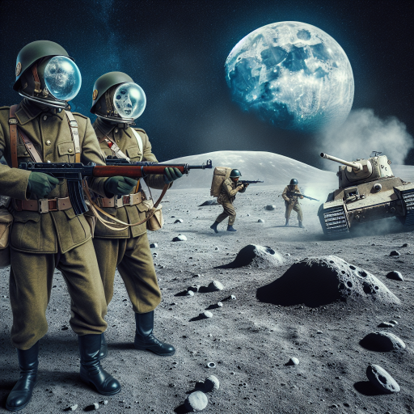

# DALL-E CLI

A command line tool for interacting with DALL-E models, supporting both `dall-e-2` and `dall-e-3`. This project is the little brother of [ChatGTP CLI](https://github.com/marcolardera/chatgpt-cli).

## Installation and configuration

Requirements: Python >= 3.10, Pip, Git

Run the following commands:

```
pip install -U pip
pip install git+https://github.com/marcolardera/dall-e-cli
```

Then set the `OPENAI_API_KEY` environment variable with your own OpenAI api key. That's all.

## Basic usage

Create an image using `dall-e-3` default parameters is easy:

`dall-e-cli "A chess player playing on top of Mt. Everest"`

Url of the generated image will be printed. Let's try with more custom parameters:

`dall-e-cli "A man wearing a banana" --model dall-e-2 --number 3 --size 1024x1024`

In this case 3 images of size 1024x1024 will be generated using `dall-e-2` and their url printed in the console.

Here is the list of all the available options (also check `dall-e-cli --help`):

|Option|Values|Note|
|---|---|---|
|`--model` (`-m`)|`dall-e-2` or `dall-e-3` (default `dall-e-3`)||
|`--number` (`-n`)|Number of images to be generated (default `1`)|Only `dall-e-2` support more then 1 image per request for now|
|`--size` (`-si`)|256x256, 512x512, 1024x1024 for `dall-e-2`, 1024x1024, 1792x1024, 1024x1792 for `dall-e-3` (default 1024x1024)||
|`--quality` (`-q`)|`hd` or `standard` (default `standard`)|Only available for `dall-e-3`|
|`--style` (`-st`)|`vivid` or `natural` (default `vivid`)|Only available for `dall-e-3`|
|`--download` (`-d`)|The directory absolute path for downloading the images|It must exist and be writable|
|`--pipe` (`-p`)||Flag for enabling prompt piping|

## Download mode

As an alternative to printing the urls of the generated images, DALL-E CLI can download them in a specific folder, using the `--download` (`-d`) option:

`dall-e-cli "A peaceful town populated by gnomes" -m dall-e-2 -n 4 --download /home/<USERNAME>/ai-images`

The output would be somethink like that:

```
0 -> /home/<USERNAME>/ai-images/1701617525_0.png written
1 -> /home/<USERNAME>/ai-images/1701617525_1.png written
2 -> /home/<USERNAME>/ai-images/1701617525_2.png written
3 -> /home/<USERNAME>/ai-images/1701617525_3.png written
```

The name of each image is made combining the timestamp with a progressive number.

## Piping

A command line tool isn't completely useful if it does not support UNIX-style pipelines, right? That's why DALL-E CLI allows to pipe prompts into it using the `--pipe` (`-p`) flag. For example:

`echo "A WW2 battle taking place on the moon" | dall-e-cli --pipe`

For people wondering, here is how it looks like:

